## 源码下载

[element-plus 官网](https://element-plus.org/)

[Github 仓库](https://github.com/element-plus/element-plus/tree/master)
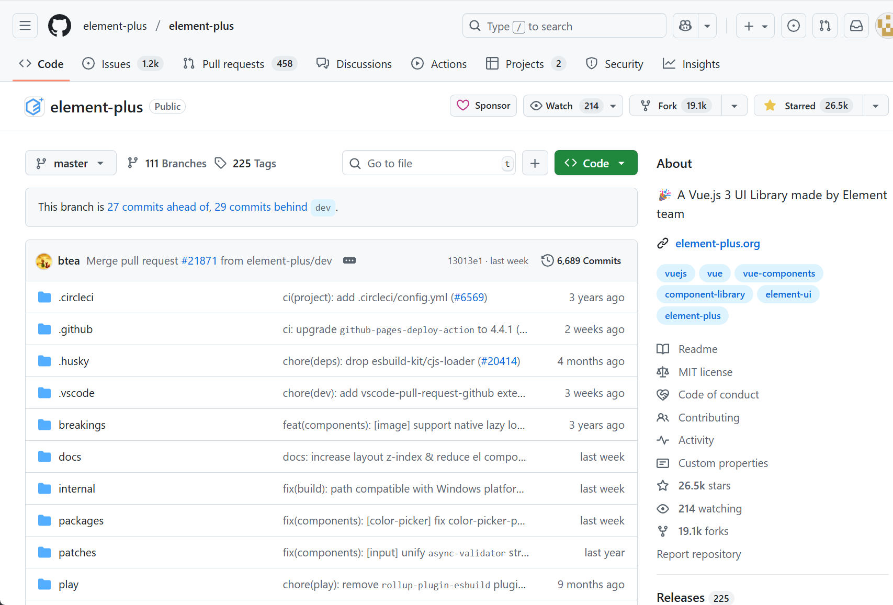

> 我们下载 master 主分支下的代码


解压下载的源码

```
  进入下载的文件夹
   cd ./element-plus-master
    安装依赖项
      pnpm install
```

### 整体目录结构

```tree
element-plus-master
├─ .circleci CI/CD配置
├─ .editorconfig 编辑器配置
├─ .env 环境变量
├─ .eslintignore  eslint 忽略
├─ .eslintrc.json eslint配置
├─ .gitattributes git配置
├─ .github  github配置
├─ .gitignore git忽略
├─ .gitpod.yml  gitpod云IDE 配置
├─ .husky 提交检验
├─ .markdownlint.json md语法检测
├─ .npmrc npm配置文件
├─ .nvmrc node版本控制
├─ .prettierignore prettier忽略
├─ .prettierrc  prettier配置
├─ .vscode  vscode编辑器配置
├─ breakings Git变更
├─ CHANGELOG.en-US.md 更改日志
├─ codecov.yml  自动化测试
├─ CODEOWNERS GitHub相关配置
├─ CODE_OF_CONDUCT.md 行为准则
├─ commitlint.config.mjs 约束提交信息
├─ CONTRIBUTING.md 贡献指南
├─ docs 文档
├─ internal element-plus 内部工具
├─ LICENSE  许可证
├─ node_modules node依赖项
├─ package.json 包声明和依赖
├─ packages monorepo工作区
├─ patches 补丁文件
├─ play 演练场
├─ pnpm-lock.yaml pnpm锁
├─ pnpm-workspace.yaml pnpm工作区声明
├─ README.md  项目介绍
├─ scripts 命令脚本
├─ ssr-testing  ssr测试
├─ tsconfig.base.json TS配置
├─ tsconfig.json TS配置
├─ tsconfig.node.json node环境下的TS配置
├─ tsconfig.play.json 演练场的TS配置
├─ tsconfig.vite-config.json  vite配置的TS配置
├─ tsconfig.vitest.json vitest单元测试的配置工具
├─ tsconfig.web.json  web浏览器的TS配置
├─ typings 类型声明
├─ vitest.config.mts Vitest相关
├─ vitest.setup.ts Vitest相关
└─ vitest.workspace.ts Vitest相关
```

我们这里可以把整个目录分为四个部分

```
1.工程化配置
  .circleci
  .editorconfig
  .env
  .eslintignore
  .eslintrc.json
  .gitattributes
  .github
  .gitignore
  .husky
  .npmrc
  .nvmrc
  .prettierignore
  .prettierrc
  .vscode
  breakings
  codecov.yml
  CODEOWNERS
  commitlint.config.mjs
  LICENSE
  node_modules
  package.json
  patches
  pnpm-lock.yaml
  pnpm-workspace.yaml
  ssr-testing
  tsconfig.base.json
  tsconfig.json
  tsconfig.node.json
  tsconfig.play.json
  tsconfig.vite-config.json
  tsconfig.vitest.json
  tsconfig.web.json
  typings
  vitest.config.mts
  vitest.setup.ts
  vitest.workspace.ts
2.组件库本身
  packages
3.辅助工具和cli脚本
  play
  .markdownlint.json
  internal
  scripts
4.文档
  CHANGELOG.en-US.md
  CODE_OF_CONDUCT.md
  CONTRIBUTING.md
  docs
  README.md
```

看着文件很多，其实很多文件是跟开源相关跟组件库本身关联不大因为他们是跟 Git 或者单元测试或者团队协作开发相关的

<font color="red"> 主要看一下 packages </font>

```
packages
        ├─ components 组件
        ├─ constants  常量定义
        ├─ directives 相关的Vue指令
        ├─ element-plus 统一出口
        ├─ hooks 复用的钩子
        ├─ locale i18n
        ├─ test-utils utils的测试
        ├─ theme-chalk 颜色主题
        └─ utils 通用工具
```

### 样式系统

我们来看一下 element-plus 的样式系统
element-plus 他的样式并不是直接写在组件里的
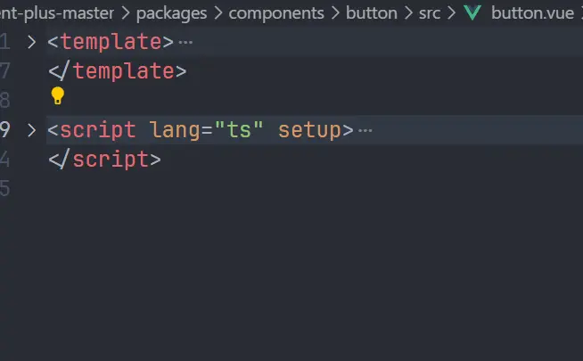
而是另外用了一个包 theme-chalk 来存放所有组件的样式和颜色变量主题
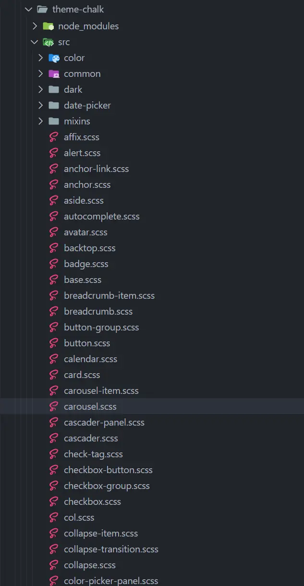
在组件里通过一个 style 文件夹里引入 theme-chalk 里对应组件的样式打包的时候再把对应的样式全部打进来
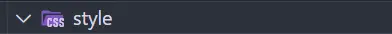
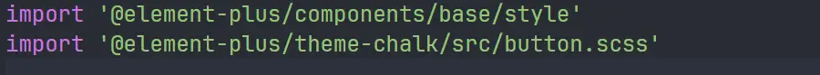

其实这样做是有好处的，能更好的打包结果优化，组件也能更专注的实现逻辑，你想想有一些组件的样式并不是两三行 css 就能写出来的，其中还要考虑颜色主题，布局排版，况且某些组件还有各种各样的形态，全部写到一个.vue 单文件组件里是有点不合适的,代码耦合度太高了。

```
src
  ├─ affix.scss
  ├─ alert.scss
  ├─ anchor-link.scss
  ├─ anchor.scss
  ├─ aside.scss
  ├─ autocomplete.scss
  ├─ avatar.scss
  ├─ backtop.scss
  ├─ badge.scss
  ├─ base.scss
  ├─ breadcrumb-item.scss
  ├─ breadcrumb.scss
  ├─ button-group.scss
  ├─ button.scss
  ├─ calendar.scss
  ├─ card.scss
  ├─ carousel-item.scss
  ├─ carousel.scss
  ├─ cascader-panel.scss
  ├─ cascader.scss
  ├─ check-tag.scss
  ├─ checkbox-button.scss
  ├─ checkbox-group.scss
  ├─ checkbox.scss
  ├─ col.scss
  ├─ collapse-item.scss
  ├─ collapse-transition.scss
  ├─ collapse.scss
  ├─ color 颜色转换处理函数
  ├─ color-picker-panel.scss
  ├─ color-picker.scss
  ├─ common 存放颜色变量、过渡动画、弹出层
  ├─ config-provider.scss
  ├─ container.scss
  ├─ dark 暗色模式下的变量
  ├─ date-picker 日期选择器
  ├─ date-picker-panel.scss
  ├─ date-picker.scss
  ├─ descriptions-item.scss
  ├─ descriptions.scss
  ├─ dialog.scss
  ├─ display.scss
  ├─ divider.scss
  ├─ drawer.scss
  ├─ dropdown-item.scss
  ├─ dropdown-menu.scss
  ├─ dropdown.scss
  ├─ empty.scss
  ├─ footer.scss
  ├─ form-item.scss
  ├─ form.scss
  ├─ header.scss
  ├─ icon.scss
  ├─ image-viewer.scss
  ├─ image.scss
  ├─ index.scss
  ├─ infinite-scroll.scss
  ├─ input-number.scss
  ├─ input-tag.scss
  ├─ input.scss
  ├─ link.scss
  ├─ loading.scss
  ├─ main.scss
  ├─ mention.scss
  ├─ menu-item-group.scss
  ├─ menu-item.scss
  ├─ menu.scss
  ├─ message-box.scss
  ├─ message.scss
  ├─ mixins
  ├─ notification.scss
  ├─ option-group.scss
  ├─ option.scss
  ├─ overlay.scss
  ├─ page-header.scss
  ├─ pagination.scss
  ├─ popconfirm.scss
  ├─ popover.scss
  ├─ popper.scss
  ├─ progress.scss
  ├─ radio-button.scss
  ├─ radio-group.scss
  ├─ radio.scss
  ├─ rate.scss
  ├─ reset.scss
  ├─ result.scss
  ├─ row.scss
  ├─ scrollbar.scss
  ├─ segmented.scss
  ├─ select-dropdown-v2.scss
  ├─ select-dropdown.scss
  ├─ select-v2.scss
  ├─ select.scss
  ├─ skeleton-item.scss
  ├─ skeleton.scss
  ├─ slider.scss
  ├─ space.scss
  ├─ spinner.scss
  ├─ splitter-panel.scss
  ├─ splitter.scss
  ├─ statistic.scss
  ├─ step.scss
  ├─ steps.scss
  ├─ sub-menu.scss
  ├─ switch.scss
  ├─ tab-pane.scss
  ├─ table-column.scss
  ├─ table-v2.scss
  ├─ table.scss
  ├─ tabs.scss
  ├─ tag.scss
  ├─ text.scss
  ├─ time-picker.scss
  ├─ time-select.scss
  ├─ timeline-item.scss
  ├─ timeline.scss
  ├─ tooltip-v2.scss
  ├─ tooltip.scss
  ├─ tour.scss
  ├─ transfer.scss
  ├─ tree-select.scss
  ├─ tree.scss
  ├─ upload.scss
  ├─ var.scss
  └─ virtual-list.scss
```

### 组件文件结构

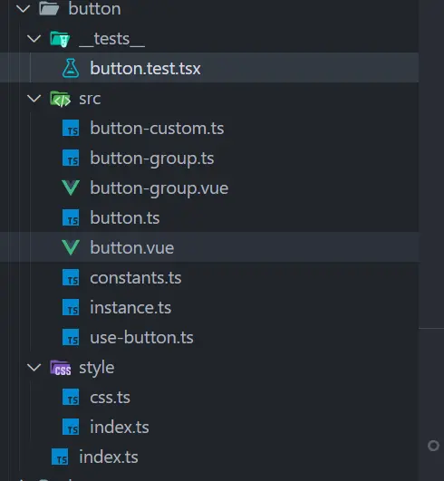
\_\_test\_\_
是组件的测试文件
button.ts 是组件相关的类型定义
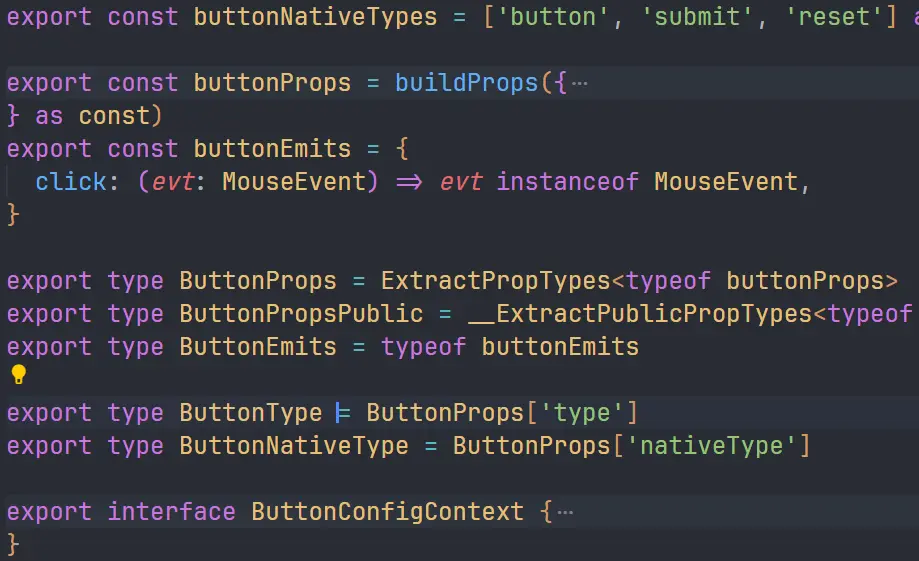
constants 是给组件注入一些上下文相关的信息
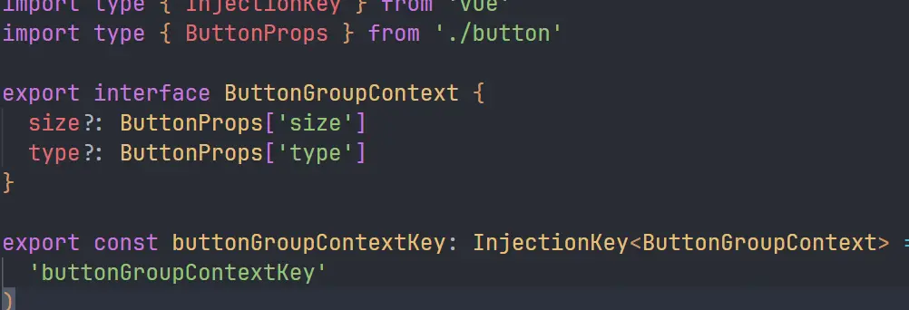
instance 是组件实列的类型
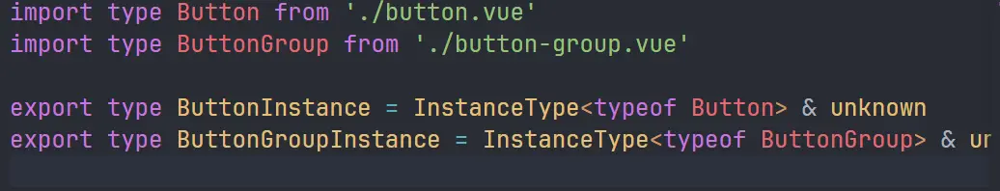
这里的 InstanceType 是 TS 内置的一个类型工具
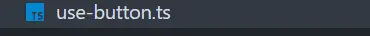
use-button 是 button 的钩子
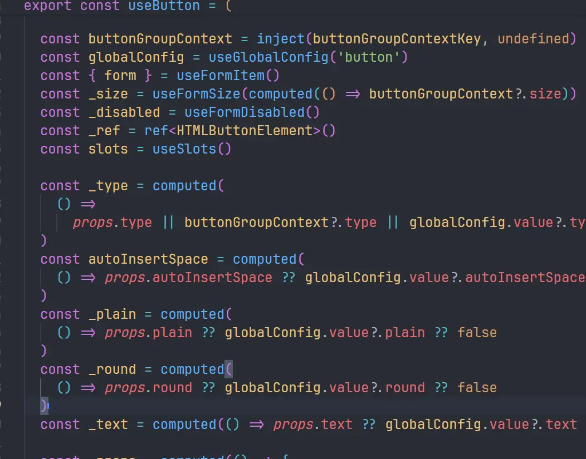
这个钩子是跟配置相关的，我们在代码中可以看到他根据 props 去找对应属性,如果没找到就沿着 instance 的 context 去找 如果还没找到就去 global 全局的配置中去找，还没找到就给一个默认值
(props -> context -> global -> default)

这个.vue SFC 文件就是组件本体了

**index.ts**
我们来看一下组件下面直接的 index.ts 文件
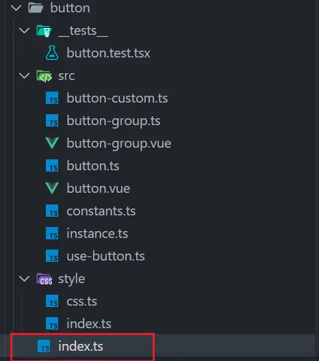
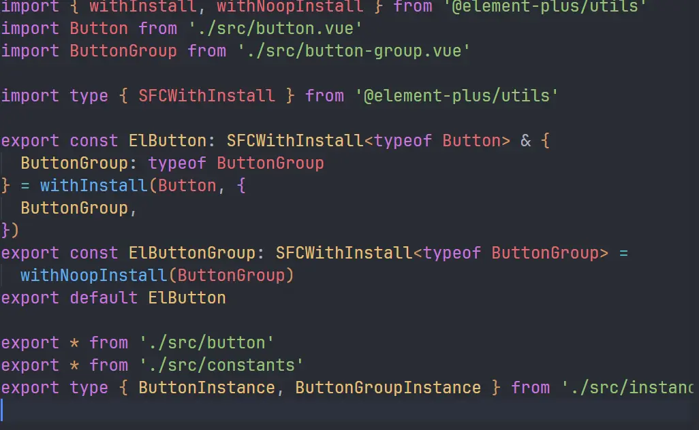
看一下**withinstall**和**withNoopInstall**这两个 util

```withinstall
export const withInstall = <T, E extends Record<string, any>>(
  main: T,
  extra?: E
) => {
  ;(main as SFCWithInstall<T>).install = (app): void => {
    for (const comp of [main, ...Object.values(extra ?? {})]) {
      app.component(comp.name, comp)
    }
  }

  if (extra) {
    for (const [key, comp] of Object.entries(extra)) {
      ;(main as any)[key] = comp
    }
  }
  return main as SFCWithInstall<T> & E
}
```

```
<>()=>{}就是 TS 里的泛型箭头函数的写法
```

他是 app.use()安装时帮我们去把组件直接挂到 app 实列上的
我们可以来调试一下 打一个 debugger
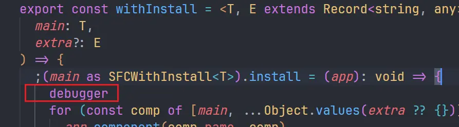
然后浏览器运行我们的测试项目直接打开 F12 调试面板刷新一下
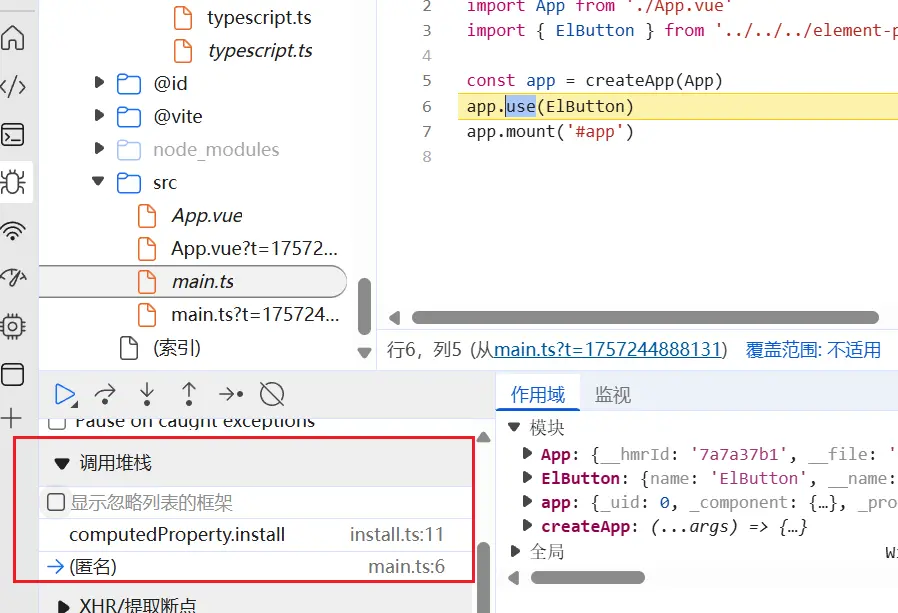
看调用堆栈，

```
computedProperty.install (install.ts:11)
use (runtime-core.esm-bundler.js:3901)
(匿名) (main.ts:6)
```

这里的匿名就是我们的 app.use
computedProerty.install 就是组件的安装函数

```
(main as SFCWithInstall<T>).install = (app): void => {
    debugger
    for (const comp of [main, ...Object.values(extra ?? {})]) {
      app.component(comp.name, comp)
    }
  }
```

### 总结

> 类型检查:TypeScript
> 代码规范:eslint、prettier
> 单元测试:vitest
> 包管理:pnpm + workspace
> 运行框架:Vue3

### 测试

创建一个测试项目。
我们找一个比较有代表性的 button 组件。

```
 pnpm create vite
```

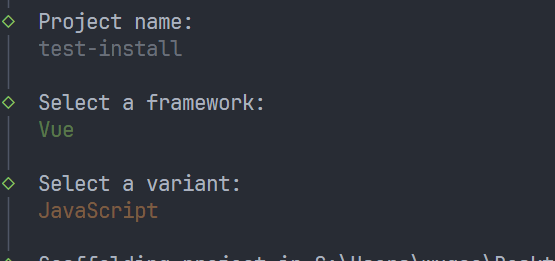

我们去引入 button 组件
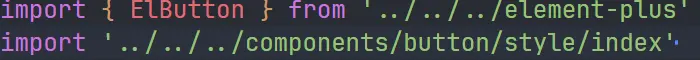
运行项目

```
pnpm run dev
```

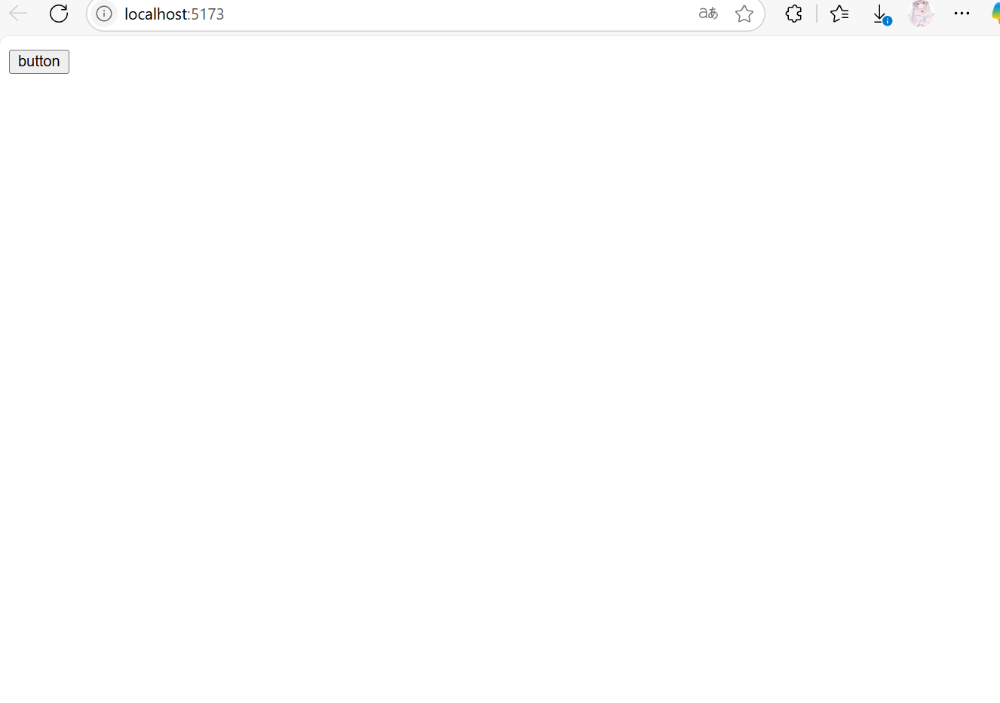
组件是正常可以加载出来的,只是样式没有加载进去

打开 F12 调试面板选择一下我们导入的 button 组件，可以看到 class 上面是有类名的
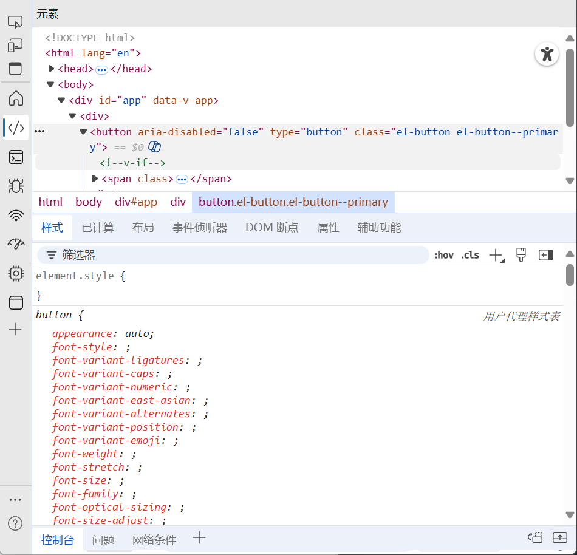
说明 vite 没有把样式相关的依赖打包进去

我们手动引入一下 button 相关的样式
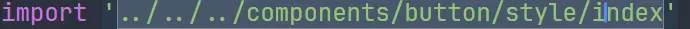

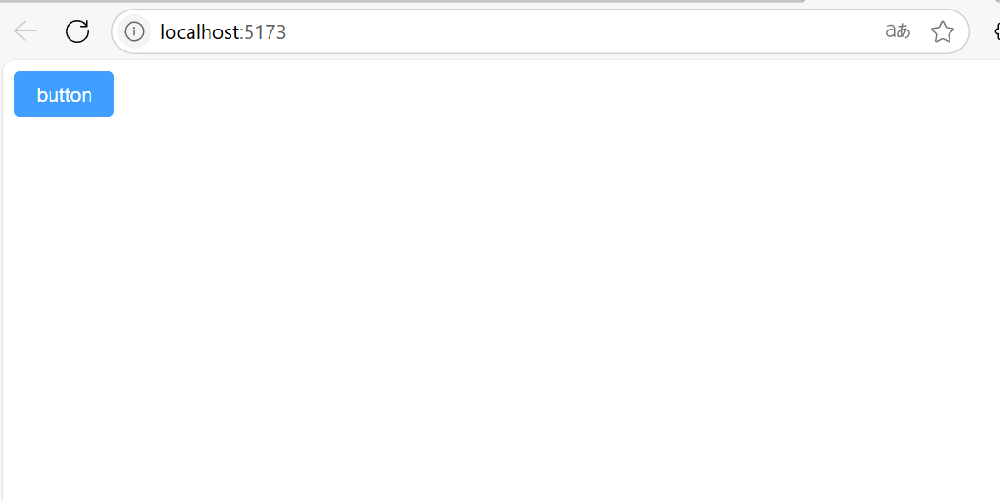
现在样式能正常加载了我们测试一下 emit 事件

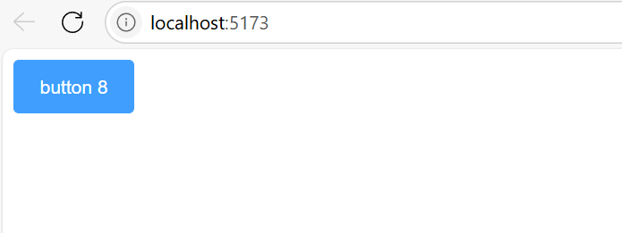
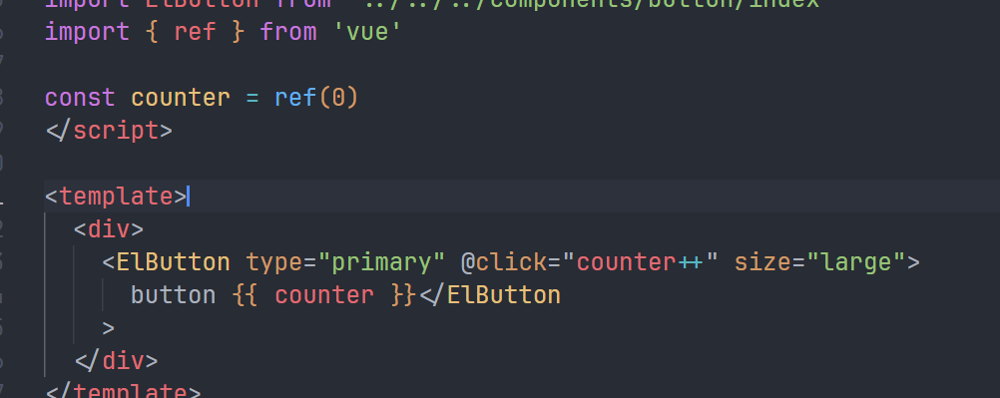
没问题样式和事件都能加载出来,说明我们引入操作没问题，到这里有细心的朋友就会问了插槽不用测试吗?其实插槽已经测试过了我们直接往 Elbutton 里写入内容就是走的插槽
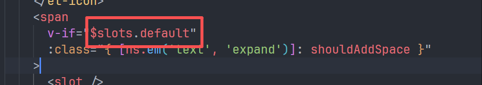
